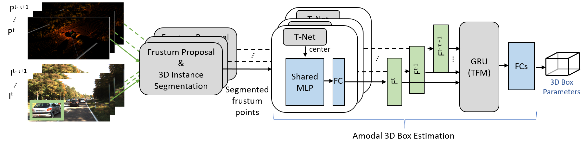

## <a name="usage"></a>Usage
This repository contains codes for the "Temp-FrustNet:  3D  Object  Detection  Using  Temporal  Fusion" paper evaluated on [KITTI Tracking Dataset](#3d-tracking). 

The installation requirements are pointed in the [Docker](#docker) section and the provided docker image can be used to run all the codes. 

## <a name="architecture"></a>Architecture

<table>
    <tr><td>

    </td></tr>
</table>


## <a name="docker"></a>Docker
The provided docker image is based on Tensorflow 1.15.2 version given with the docker hub tag "tensorflow/tensorflow:1.15.2-gpu-py3", which supports gpu usage. The "docker/Dockerfile" text file indicates the installation of [Tensorflow Object Detection API](https://github.com/tensorflow/models/tree/master/research/object_detection), OpenCV, and required python libraries defined in "docker/requirements.txt" file. The image built can be pulled from Docker Hub as shown below.

```bash
docker pull emecercelik/tum-i06-object_detection:faster_frustum_nonroot_v3
``` 
The docker image can be run with the dataset-related volume mounts as shown in "run_docker.sh" file. This mounting example is compatible with the example shell scripts given in the sections below for running architecture. 

## <a name="3d-tracking"></a>3D Detection with KITTI Tracking Dataset
<ol>
<li>Download dataset</li>
The KITTI Multi-object Tracking Dataset (Tracking dataset) can be downloaded using the links in the official [website](http://www.cvlibs.net/datasets/kitti/eval_tracking.php) of KITTI. To use with the extended Frustum PointNets module, the [left color images](http://www.cvlibs.net/download.php?file=data_tracking_image_2.zip), [Velodyne point clouds](http://www.cvlibs.net/download.php?file=data_tracking_velodyne.zip), [camera calibration matrices](http://www.cvlibs.net/download.php?file=data_tracking_calib.zip), and [training labels](http://www.cvlibs.net/download.php?file=data_tracking_label_2.zip) should be downloaded.

Downloaded zip files should be extracted in the same root_dir to have the following path order (0000,0001,... are drive indices and 000000,000001,... are frame indices):

```
root_dir
	data_tracking_image_2
		training
			image_02
				0000
					000000.png
					...
				0001
					000000.png
					...
				...
		testing
			image_02
				...
	data_tracking_label_2
		training
			label_02
				0000.txt
				0001.txt
				...
	data_tracking_velodyne
		training
			velodyne
				0000
					000000.bin
					...
				0001
					000000.bin
					...
				...
		testing
			velodyne
				...
	data_tracking_calib
		training
			calib
				0000.txt
				0001.txt
				...
		testing
			calib
				...
		
```
<li>Prepare training data</li>
Since Frustum PointNet uses the points extracted from the frustum of a 2D bounding box, these points should be prepared before training. To prepare .pickle data that is used during training from KITTI tracking dataset, the script shell seen below can be run. The flags used in the script should be adjusted according to the needs, which are explained in the file itself. 

```bash
./frustum-pointnets/kitti/prepare_data_tracking.sh
```

This code will generate "frustum_carpedcyc_tracking_train.pickle" and "frustum_carpedcyc_tracking_val.pickle" files if the name is kept same in the script. The pickle files used for this paper can be found [here](https://syncandshare.lrz.de/getlink/fiSdroThP6hkhMpWWRYSeQox/).
<li>Train network</li>
Run the script seen below to train the Frustum PointNet on the KITTI tracking data. The layers for temporal data processing can be selected in the bash script. The flags are explained in frustum-pointnets/scripts/README. 

```bash
./frustum-pointnets/scripts/tracking_train_v1.sh
```
The tracking module will directly utilize the prepared pickle files with the names given in the previous bullet point. These files will be used for training and validation. The training outputs, which are logs and trained model parameters, are saved in the log directory that is defined with the flag (--log_dir) in the bash file.
<li>Validate network</li>
Validation of the network is done during the training and results can be seen in the log file. The validation data can be also used for inference with the trained network to have Average Precision metrics calculated.

<li>Inference</li>
The following bash file can be run for inference. The meaning of flags are explained in the bash file. The test_tracking.sh script generates detection results in KITTI format under the log_path/detection_results/data/"drive_id"/data directory. These results are *.txt files with the names of images. The generated detection results can be used for calculating metrics and visualization of detections.

```bash
./frustum-pointnets/scripts/test_tracking.sh
```
To conduct inference on the validation data, which has ground-truth labels, the --from_rgb_detection flag should be removed and the paths to the trained network and to the validation pickle file should be provided. This is necessary to calculate metrics (Average precision values) on the detections of the trained network. 

To run the inference with data that don't have ground-truth labels, the pickle file for the inference data should be prepared. In this part, the frustums (LiDAR points corresponding to 2D bounding box) are extracted using predicted 2D bounding boxes, which are provided by Faster RCNN as an output. This step can be done running the following bash script with --rgb_detection_path flag set accordingly. 

```bash
./frustum-pointnets/kitti/prepare_data_tracking.sh
```

The meaning of flags and how to use them are explained in the script itself. This script will generate a pickle file with the name of "frustum_carpedcyc_tracking_val_rgb_detection.pickle". test_tracking.sh script can be updated with the name of this pickle file and the inference can be run by running the test_tracking.sh bash script as shown above.

<li>Calculate metrics</li>
To calculate average precision metrics on the trained networks, run the bash script below with the ground-truth path and detection path entered inside. 

```bash
./frustum-pointnets/kitti/eval_tracking.sh
```
Detection path shows the folder, inside which there is a data folder with the detections of each frame as shown below. 000000.txt, 000001.txt shows the frame id and the txt file contains detections in KITTI format.

```
root_dir
	data
		000000.txt
		000001.txt
		...
```
Ground-truth path contains the ground-truth labels of frames in a drive in a separate folder as can be seen below. The path used in the script is therefore root_dir/0011 for the example below.

```
root_dir
	0011
		000000.txt
		000001.txt
		...
```
Indices of txt files in the detection folder and in the ground-truth folder should match each other to have a correct evaluation. For the KITTI tracking dataset, ground-truth labels are not provided in this format. Therefore, the script below can be used to convert tracking ground-truth labels into KITTI object detection format. Before running, the flags inside should be set accordingly and explanation of the flags are provided in the script itself.

```bash
./frustum-pointnets/scripts/tracking2object.sh
```
eval_tracking.sh script provides results under the detection path by generating a folder named as plot. Inside this folder precision-recall curves and AP values can be seen. <class name>_detection.txt corresponds to BEV detection results and at the last line of the txt file AP results can be seen for easy, moderate, and hard difficulty levels of KITTI tracking. <class name>_detection_3d.txt corresponds to 3D detection results and similarly AP results can be seen at the last line of the txt file. Additionally summary.txt provides the summary of results for that drive for all types.

</ol>


